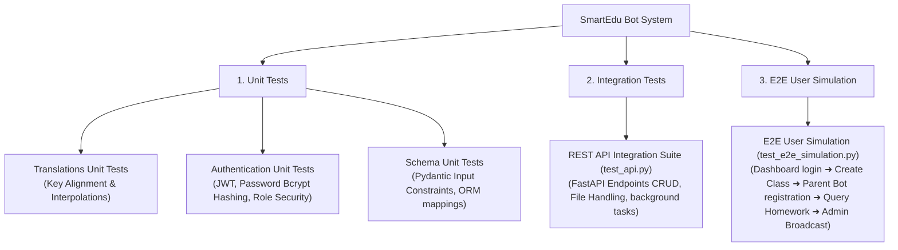

# SmartEdu Bot - Testing Report Wiki Page

This document serves as the official **Testing Report and Strategy Documentation** for the SmartEdu school communication system. It describes the test architecture, individual test cases, simulated workflows, local execution runbooks, and recent validation results.

---

## 1. Testing Strategy & Architecture

The SmartEdu Bot system utilizes a multi-layered testing pyramid to guarantee API compliance, language localization safety, secure dashboard access, and seamless user experiences across its three surfaces (Web Dashboard, REST API, and Telegram Bot).



---

## 2. Test Suite Details

### A. Unit Tests (Isolated Logic)
Unit tests verify the correctness of functions and components in isolation without database or network connections.

*   **Translations Suite ([test_translations_unit.py](file:///d:/DUC-Learning-All-Year/Year3/Software%20Project%20Development/Code/SmartEdu_bot%20-%20Copy%20(2)/tests/test_translations_unit.py))**:
    *   **Structure Check**: Ensures every key in the dictionary `STRINGS` contains both English (`"en"`) and Khmer (`"km"`) strings.
    *   **Placeholder Alignment**: Verifies that translation placeholders (e.g. `{name}`, `{date}`, `{code}`) are identical in both languages to prevent formatting crashes, allowing English-only grammatical plurals (`{plural}`) where appropriate.
    *   **Fallback Lookup**: Verifies that requests for unsupported languages fallback gracefully to English, and unknown keys return the key string itself.
*   **Authentication Suite ([test_auth_unit.py](file:///d:/DUC-Learning-All-Year/Year3/Software%20Project%20Development/Code/SmartEdu_bot%20-%20Copy%20(2)/tests/test_auth_unit.py))**:
    *   **Bcrypt Operations**: Tests password checking helpers against encrypted hashes.
    *   **User Lookup**: Verifies credentials lookup dynamically against environment variables with trimming.
    *   **JWT Token Operations**: Verifies token creation, custom expirations, and token decoding signatures.
    *   **Role Protection**: Verifies FastAPI route protections (e.g. enforcing admin-only access and rejecting teacher access with 403 Forbidden).
*   **Schemas Validation Suite ([test_schemas_unit.py](file:///d:/DUC-Learning-All-Year/Year3/Software%20Project%20Development/Code/SmartEdu_bot%20-%20Copy%20(2)/tests/test_schemas_unit.py))**:
    *   **Schema Fields**: Tests input structures for `ClassCreate`, `HomeworkCreate`, `HolidayCreate`, and `SubscriberUpsert`.
    *   **Field Constraints**: Verifies that missing required arguments or bad datatypes raise Pydantic `ValidationError` issues.
    *   **ORM Compatibility**: Verifies that serializing output DTOs directly from database entity classes (ORM attributes) maps correctly.

### B. Integration Tests (API Endpoints)
Integration tests target the backend REST API by simulating HTTP requests to verify routing, databases, and middleware logic.

*   **API Suite ([test_api.py](file:///d:/DUC-Learning-All-Year/Year3/Software%20Project%20Development/Code/SmartEdu_bot%20-%20Copy%20(2)/test_api.py))**:
    *   Runs 11 sequential validation steps against a running FastAPI server:
        1.  **Health Check**: Verifies `/health` endpoint responds with code 200.
        2.  **Admin Authentication**: Posts credentials to `/api/auth/login` to retrieve a JWT access token.
        3.  **Class CRUD (Happy Path)**: Registers class `TEST99` via the database.
        4.  **List Classes**: Pulls the list of classes and verifies `TEST99` is included.
        5.  **Submit Homework**: Publishes a new assignment for class `TEST99` (with optional file upload validation).
        6.  **Fetch Class Homework**: Queries assignments for `TEST99` and checks for matching descriptions.
        7.  **Fetch ALL Homework**: Hits the optimized unified homework feed `/api/homework/ALL` and ensures it resolves successfully.
        8.  **Manage Holidays**: Registers a public holiday closures entry.
        9.  **Register Subscriber**: Mocks parent joining on Telegram by calling `/api/subscribers`.
        10. **Link Subscriber Class**: Binds the Telegram parent user to `TEST99`.
        11. **Enqueues Broadcast**: Posts a message to `/api/broadcast` which pushes Telegram sendMessage requests in a background thread task.
    *   **Clean Up**: Automatically deletes created holiday, class, and homework database rows to keep environment clean.

### C. End-to-End User Simulation Tests
End-to-end user simulation tests verify the collaborative user flow of different roles (Teachers, Administrators, and Parents) across dashboard actions and bot interactions.

*   **E2E Simulator ([test_e2e_simulation.py](file:///d:/DUC-Learning-All-Year/Year3/Software%20Project%20Development/Code/SmartEdu_bot%20-%20Copy%20(2)/tests/test_e2e_simulation.py))**:
    *   Creates an isolated, in-memory SQLite database (`./test_e2e.db`) using dependency injections to avoid polluting real database files.
    *   Mocks outbound `httpx` HTTP requests to Telegram API endpoints to allow complete offline execution.
    *   **Teacher Role**: Logs into the dashboard, registers a class (`GRADE-10`), and uploads homework.
    *   **Parent Role**: Simulates bot joining, sets prefered language to Khmer (`km`), links to class `GRADE-10`, and pulls class homework.
    *   **Bot Translation**: Verifies the homework message returned by the backend is translated and formatted in Khmer successfully.
    *   **Admin Role**: Sends a school broadcast which successfully updates database records and enqueues to the parent user.
    *   **Tear Down**: Automatically disposes connections, drops tables, and deletes the test SQLite file.

---

## 3. Local Test Runbook (Execution Guide)

### Prerequisites
Make sure dependencies are installed. You can install them by running:
```bash
pip install -r backend/requirements.txt
```

### The Automatic Test Runner (Recommended)
You can run the entire test suite (Unit, E2E, and Live API Integration) with a single command. The runner automatically manages temporary SQLite databases, starts a background FastAPI server on port 8001, runs all tests, and shuts down the test server cleanly.

Run it from the project root directory:
```bash
python run_tests.py
```

### Running Suites Individually
If you want to run specific test categories or scripts separately:

*   **Run Unit & E2E Simulation Tests only**:
    ```bash
    python -m unittest discover -s tests -p "test_*.py"
    ```
*   **Run a specific test file (e.g. Translation checks)**:
    ```bash
    python -m unittest tests/test_translations_unit.py
    ```
*   **Run Live Integration tests manually**:
    1. Start your API server locally (e.g. `uvicorn main:app --reload --port 8000` from `backend/`).
    2. Set environment configurations matching your running server in `.env`.
    3. Execute the script:
       ```bash
       python test_api.py
       ```

---

## 4. Validation Results & Execution Logs

Below is a record of a complete execution of the test suite runner (`run_tests.py`):

```text
==================================================
   SmartEdu Bot - Test Automation Runner
==================================================
Python interpreter: C:\Users\ROG\AppData\Local\Programs\Python\Python314\python.exe
Current workspace: D:\DUC-Learning-All-Year\Year3\Software Project Development\Code\SmartEdu_bot - Copy (2)
==================================================
==================================================
   Running Unit Test Suites
==================================================
test_authenticate_user_fail (test_auth_unit.TestAuth.test_authenticate_user_fail)
Test authentication failures with wrong credentials or unknown users. ... ok
test_authenticate_user_stripping (test_auth_unit.TestAuth.test_authenticate_user_stripping)
Test that authenticate_user strips leading and trailing whitespaces. ... ok
test_authenticate_user_success (test_auth_unit.TestAuth.test_authenticate_user_success)
Test authentication with correct credentials. ... ok
test_create_access_token (test_auth_unit.TestAuth.test_create_access_token)
Verify that JWT tokens encode data correctly and hold expiration times. ... ok
test_get_current_user_invalid (test_auth_unit.TestAuth.test_get_current_user_invalid)
Test that get_current_user raises 401 Unauthorized for malformed/signature-invalid tokens. ... ok
test_get_current_user_valid (test_auth_unit.TestAuth.test_get_current_user_valid)
Test extraction of current user from a valid active JWT token. ... ok
test_require_admin_role_enforcement (test_auth_unit.TestAuth.test_require_admin_role_enforcement)
Test admin role checks; allow admins but block others with 403 Forbidden. ... ok
test_class_create_validation (test_schemas_unit.TestSchemas.test_class_create_validation)
Verify ClassCreate requirements and parsing. ... ok
test_class_out_orm_compatibility (test_schemas_unit.TestSchemas.test_class_out_orm_compatibility)
Verify ClassOut can populate fields from ORM attributes successfully. ... ok
test_holiday_create_validation (test_schemas_unit.TestSchemas.test_holiday_create_validation)
Verify HolidayCreate accepts reason as optional while title and dates are required. ... ok
test_homework_create_validation (test_schemas_unit.TestSchemas.test_homework_create_validation)
Verify HomeworkCreate validation constraints. ... ok
test_homework_out_orm_compatibility (test_schemas_unit.TestSchemas.test_homework_out_orm_compatibility)
Verify HomeworkOut conversion handles optional file details correctly. ... ok
test_login_request_validation (test_schemas_unit.TestSchemas.test_login_request_validation)
Verify LoginRequest rejects missing fields but accepts complete structures. ... ok
test_subscriber_out_orm_compatibility (test_schemas_unit.TestSchemas.test_subscriber_out_orm_compatibility)
Verify SubscriberOut maps active states, registered class, default languages. ... ok
test_subscriber_upsert_validation (test_schemas_unit.TestSchemas.test_subscriber_upsert_validation)
Verify SubscriberUpsert accepts partial profile fields from Telegram callback payloads. ... ok
test_placeholder_alignment (test_translations_unit.TestTranslations.test_placeholder_alignment)
Ensure that English and Khmer translations contain the exact same curly brace placeholders (except language-specific pluralization). ... ok
test_strings_structure (test_translations_unit.TestTranslations.test_strings_structure)
Verify that every entry in STRINGS has exactly 'en' and 'km' keys. ... ok
test_translation_formatting (test_translations_unit.TestTranslations.test_translation_formatting)
Test that string interpolation functions correctly and handles parameters. ... ok
test_translation_function_basic (test_translations_unit.TestTranslations.test_translation_function_basic)
Test the lookup and formatting capabilities of the t() helper function. ... ok

----------------------------------------------------------------------
Ran 19 tests in 0.004s

OK

[PASS] Unit tests passed successfully!

==================================================
   Running E2E Simulation Test
==================================================
test_e2e_user_workflow (test_e2e_simulation.TestE2ESimulation.test_e2e_user_workflow)
Simulate a complete user journey between Dashboard, Backend, and Telegram Bot. ... ok

----------------------------------------------------------------------
Ran 1 test in 1.395s

OK

[PASS] E2E simulation tests passed successfully!

==================================================
   Running Live API Integration Tests
==================================================
Starting backend test server in 'D:\DUC-Learning-All-Year\Year3\Software Project Development\Code\SmartEdu_bot - Copy (2)\backend' on port 8001...
Waiting for server to become healthy...
Server is up and healthy!
Running 'D:\DUC-Learning-All-Year\Year3\Software Project Development\Code\SmartEdu_bot - Copy (2)\test_api.py'...
==================================================
     SmartEdu Bot - API Integration Test Suite    
==================================================
Target Server: http://127.0.0.1:8001
Admin User:    edubotadmin
==================================================
[PASS] Health Check -> /health responded successfully
[PASS] Admin Login -> Received JWT access token successfully
[PASS] Create Class -> Created class 'TEST99' (ID: 1)
[PASS] List Classes -> Found 'TEST99' in database classes list
[PASS] Submit Homework -> Submitted homework successfully (ID: 1)
[PASS] Fetch Class Homework -> Successfully retrieved homework for 'TEST99'
[PASS] Fetch ALL Homework -> Successfully fetched unified homework feed (entries count: 1)
[PASS] Create Holiday -> Added public holiday (ID: 2)
[PASS] Register Subscriber -> Registered parent Telegram ID '99999999'
[PASS] Set Subscriber Class -> Subscriber class bound to 'TEST99' successfully
[PASS] Queue Broadcast Announcement -> Broadcast background task enqueued (Sent estimate: 5)
--------------------------------------------------
Cleaning up test records from local DB...
Cleanup finished successfully.
==================================================
     ALL API INTEGRATION TESTS PASSED SUCCESSFULLY!
Your optimized backend processes are running smoothly.
==================================================
Stopping backend test server...
Server stopped successfully.

[PASS] Live API integration tests passed successfully!

==================================================
   [PASS] ALL TEST SUITES PASSED SUCCESSFULLY! (Time: 5.52s)
==================================================
```

> [!NOTE]
> All test databases used are isolated (`test_runner.db` and `test_e2e.db`) and are deleted automatically during test teardown steps to prevent workspace clutter.
